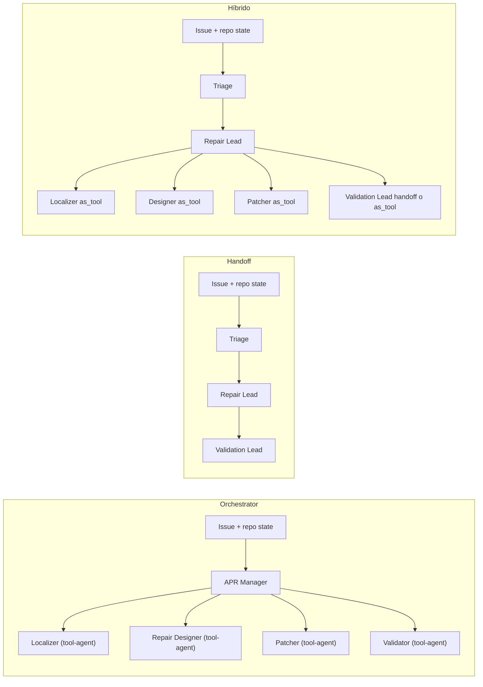
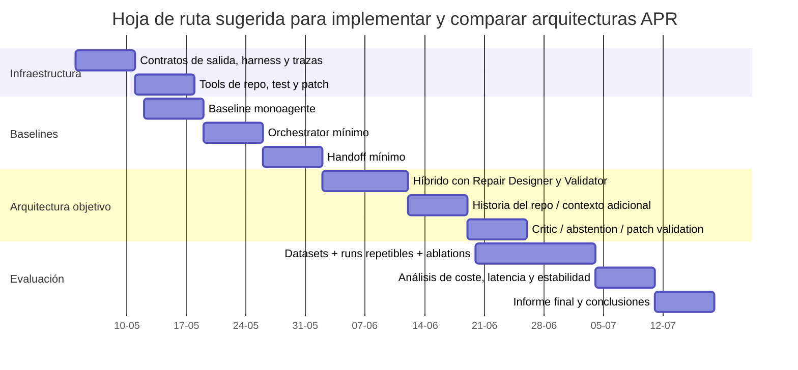

# Arquitecturas multiagente por roles para APR con el SDK Python de OpenAI Agents

**Resumen ejecutivo.** Entre 2024 y 2026, el estado del arte de Automated Program Repair (APR) basado en LLMs ha pasado de pipelines relativamente simples —localización, reparación y validación— a diseños cada vez más **role-based**, donde agentes especializados se reparten subtareas como localización, inferencia de intención, diseño de la reparación, síntesis de parches, validación, crítica y recuperación de contexto histórico o dinámico. En paralelo, el SDK Python de entity["company","OpenAI","ai company"] Agents ha estabilizado dos primitivas de orquestación muy relevantes para tu caso: **handoffs** y **agents-as-tools**; además, añade contexto tipado, structured outputs, memoria de sesión, trazas, guardrails, aprobación humana y, en Python, sandbox workspaces persistentes. La convergencia entre ambos mundos es clara: la literatura APR empuja hacia roles más finos; el SDK ofrece justo las primitivas necesarias para implementarlos y compararlos rigurosamente. citeturn20view0turn20view1turn18view0turn19view0turn28view0turn6view8turn7view8

Para un proyecto cuyo objetivo es **comparar** arquitecturas y no solo maximizar un leaderboard, la mejor decisión práctica no es empezar por un multiagente muy fragmentado, sino por dos baselines controlables: **orchestrator mínimo** y **handoff mínimo**. Mi recomendación es que el baseline principal sea un **orchestrator (agents-as-tools)** con cuatro roles núcleo —coordinación, localización, parcheo y validación— porque es el patrón más fácil de observar, depurar, acotar en coste y evaluar con trazas. Después, conviene implementar un **handoff mínimo** en el que un triage agent transfiera propiedad a un repair lead y, opcionalmente, a un validation lead. El patrón que, a mi juicio, tiene más valor científico y más probabilidad de rendir bien en repositorios reales es un **híbrido**: handoff en cambios de fase y agents-as-tools dentro de cada fase. Esto encaja tanto con la guía oficial del SDK como con sistemas de 2025–2026 que ganan rendimiento cuando separan razonamiento, localización, diseño, reparación y verificación. citeturn20view0turn8view2turn11view3turn12view3turn29view0turn7view8turn6view8turn7view9

La literatura reciente también deja una advertencia importante: **más agentes no implica mejor APR**. En 2024, Agentless mostró que un pipeline interpretable de tres fases podía superar a muchos agentes abiertos y a bajo coste; en 2025, estudios comparativos concluyeron que la calidad del modelo base importa, pero también importa mucho el diseño del flujo agentic, especialmente en localización y reproducción; y en 2025–2026, trabajos de diseño de MAS para software engineering identificaron la **role-based cooperation** como patrón dominante, pero no como una receta universal. La consecuencia para tu diseño es clara: cada rol debe justificarse por un **cambio real de contrato** —instrucciones, herramientas, política o salida estructurada— y no por “estilo organizativo”. citeturn25view2turn25view3turn6view10turn19view0turn18view1

Por último, el plan experimental debe reconocer que **SWE-bench Verified ya no basta por sí solo** para medir frontera en 2026. Sigue siendo útil para comparabilidad histórica, pero OpenAI ha documentado problemas de contaminación y saturación; por eso, el diseño experimental debería combinar Verified con al menos un set adicional más fresco o menos contaminado, junto con métricas de trazas, localización, coste, latencia, estabilidad y utilidad para revisión humana. En otras palabras: para comparar arquitecturas, no basta con “pass/fail tests”; hay que medir **cómo** llega cada arquitectura al parche y qué fricción crea. citeturn24view0turn24view1turn23view0turn23view1turn28view3

## Panorama 2024–2026

El panorama reciente se entiende mejor si se separan tres capas. La primera es la **capa de infraestructura oficial**. En el SDK Python de Agents, un agente se define con `instructions`, herramientas, guardrails, handoffs y opcionalmente `output_type`; la documentación oficial distingue explícitamente dos patrones multiagente: **manager/orchestrator con `Agent.as_tool()`**, donde un agente central mantiene el control de la respuesta, y **handoffs**, donde el control pasa al especialista. El SDK añade, además, `RunContextWrapper` para estado local tipado no visible al modelo, sesiones para mantener historial, trazas activadas por defecto, aprobación humana para tools sensibles y filtros de historial en handoffs. Estas capacidades no son accesorias: son exactamente las que hacen viable una comparación limpia entre arquitecturas APR. citeturn11view7turn20view0turn8view5turn10view7turn10view0turn10view2turn10view1turn8view8

La segunda capa es la **evolución general de los MAS para software engineering**. En 2024 apareció una revisión de sistemas multiagente para SE que ya planteaba que el valor de estos sistemas está en la especialización, la colaboración y la escalabilidad sobre tareas complejas del ciclo de vida del software. Ese mismo año, un survey amplio sobre LLM-based agents para SE recopiló 124 trabajos y subrayó explícitamente que la sinergia entre múltiples agentes y la interacción humana abre una línea prometedora para resolver problemas reales de ingeniería del software. En 2025, un estudio específico sobre diseño de MAS para SE, basado en 94 artículos, concluyó que **Role-Based Cooperation** era el patrón de diseño más frecuente, y que la **functional suitability** era el atributo de calidad que más guiaba dichas arquitecturas. Para tu proyecto, esto es importante porque legitima científicamente una descomposición por roles, pero también sugiere que la selección de roles debe responder a atributos de calidad concretos: corrección, trazabilidad, mantenibilidad y aislamiento de políticas. citeturn18view1turn18view0turn19view0turn19view1

La tercera capa es la **trayectoria específica del APR con LLMs**. En 2024, AutoCodeRover propuso un enfoque muy orientado a software engineering: code search estructurado sobre AST, fault localization guiada por tests y construcción iterativa de contexto; reportó 19% en SWE-bench Lite con un coste medio de 0,43 USD por instancia. Ese mismo año, MarsCode Agent consolidó un loop más claramente agentic basado en planning, reproducción del bug, localización, generación de parches y validación. También en 2024, DRCodePilot mostró que inyectar **design rationale** desde issue logs y usar reflexión guiada mejora sustancialmente APR, lo que anticipa el valor de separar un rol de “repair designer” del rol de “patch generator”. Y, crucialamente, Agentless recordó que una arquitectura sencilla de tres fases —localización, reparación y validación— puede ser una baseline muy fuerte, tanto en rendimiento como en coste, sin autonomía tool-driven compleja. citeturn7view0turn7view5turn7view1turn7view6turn7view2turn7view7turn25view2turn25view4

En 2025, el foco pasó de “si los agents funcionan” a **por qué unas arquitecturas funcionan mejor que otras**. El estudio empírico sobre LLM-based Agents for Automated Bug Fixing en SWE-bench Verified comparó seis sistemas líderes y concluyó que aún hace falta optimizar tanto la capacidad del modelo como el **agentic flow**, en particular la localización y la reproducción. En paralelo, un survey específico de LLM-based APR revisó 63 sistemas publicados entre enero de 2022 y junio de 2025 y organizó el campo en cuatro paradigmas, destacando una conclusión muy útil para tu tesis de diseño: los **frameworks agentic** son especialmente atractivos para bugs multi-hunk o cross-file, pero pagan ese beneficio con **más latencia y complejidad**. También en 2025 aparecieron propuestas más claramente role-based: AdverIntent-Agent separó **reasoning agent**, **test agent** y **repair agent** para inferir intención del programa y evitar sobreajuste al test-suite; ALMAS propuso una visión más amplia alineada con roles ágiles, desde planificación hasta testing y revisión; y RTADev introdujo chequeos de alineación y revisiones ad hoc para reducir errores de coordinación entre agentes. citeturn6view10turn28view0turn29view0turn19view2turn18view4turn17search13

En 2026, la especialización de roles se hizo todavía más explícita. SGAgent formalizó el patrón **localize → suggest → fix**, añadiendo un rol intermedio de “suggester” para cerrar la brecha entre “dónde está el bug” y “cómo repararlo”, con 51,3% de repair accuracy en SWE-Bench y 1,48 USD por instancia en su configuración reportada. AgentForge convirtió la verificación ejecutada en una **restricción de primer orden** y repartió la responsabilidad entre **Planner, Coder, Tester, Debugger y Critic**, con sandbox obligatorio. SelfHeal, dirigido al arreglo de bugs en sistemas agentic, usó dos agentes ReAct independientes —**fix** y **critic**— y además aportó un benchmark nuevo, AgentDefect. TraceRepair fue aún más lejos al usar **runtime traces** como restricciones compartidas y una especie de comité multiagente de validación. Por su parte, HAFixAgent mostró que el **historial del repositorio** puede ser una fuente contextual de valor, mejorando efectividad y robustez sin disparar el coste. En conjunto, estas propuestas dibujan una convergencia muy clara: los roles que más se repiten ya no son “programador genérico” y “revisor genérico”, sino **localización, intención/diseño, síntesis, validación, crítica y recuperación contextual**. citeturn7view8turn6view8turn7view9turn26view1turn28view2

Hay una última observación metodológica que no deberías ignorar. SWE-bench Verified fue clave entre 2024 y 2025, y el sitio oficial lo sigue presentando como un subconjunto de 500 instancias validadas por humanos, creado en colaboración con OpenAI. Pero en febrero de 2026, OpenAI publicó un análisis argumentando que Verified ya no mide bien la frontera por contaminación y problemas residuales de tests; recomendó reportar resultados en SWE-bench Pro para seguimiento de frontera. Eso no invalida Verified para comparar arquitecturas en un entorno académico controlado, pero sí obliga a interpretarlo como **benchmark histórico/comparable**, no como métrica única ni definitiva del progreso real. citeturn24view1turn24view0

## Patrones arquitectónicos

Desde el punto de vista del SDK, la distinción central no es “monoagente vs multiagente”, sino **quién conserva la propiedad de la respuesta y del estado de decisión**. La guía oficial resume el dilema así: usa **handoffs** cuando el especialista debe hacerse cargo de la conversación para esa rama del trabajo; usa **agents as tools** cuando un manager debe seguir al mando y llamar a especialistas como capacidades acotadas. La propia guía recomienda empezar con un solo agente y dividir **solo cuando cambie materialmente el contrato** —capacidad, política, claridad del prompt o trazabilidad—, lo que en APR equivale a decir: crea un rol nuevo solo si necesita herramientas, criterios de parada o salida estructurada realmente distintos. citeturn20view0turn8view1turn8view2

La siguiente tabla sintetiza la comparación práctica entre arquitecturas y su mapeo natural a roles APR. La tabla es una **síntesis** de la documentación oficial del SDK y de la evidencia reciente en APR y MAS para SE. citeturn20view0turn11view7turn19view0turn7view8turn6view8turn29view0

| Patrón | Propiedad de la respuesta | Primitiva SDK dominante | Mapeo APR más natural | Ventajas principales | Riesgos principales |
|---|---|---|---|---|---|
| Orchestrator | La mantiene un manager central | `Agent.as_tool()` | Manager → Localizer → Designer → Patcher → Validator | Más determinismo, evaluación más limpia, guardrails compartidos, presupuesto global fácil de controlar | El manager puede convertirse en cuello de botella; prompt central más complejo |
| Handoff | Pasa al especialista de la fase | `handoffs`, `handoff()` | Triage → Repair Lead → Validation Lead | Especialistas con autonomía real, prompts más simples por fase, ownership semántico claro | Más riesgo de inflación del historial, guardrails distribuidos de forma desigual, mayor dificultad para un presupuesto global |
| Híbrido | Mixto: handoff entre fases; tools dentro de cada fase | `handoffs` + `Agent.as_tool()` | Triage → Repair Lead; dentro del Repair Lead: Localizer/Designer/Patcher como tools; opcional handoff final a Validation Lead | Mejor equilibrio entre claridad por fase y control central en subtareas acotadas | Mayor complejidad de implementación y de análisis experimental |

Para APR, el **orchestrator** es normalmente el mejor primer baseline multiagente. En la literatura, muchos sistemas de alto rendimiento pueden reinterpretarse como “orquestadores” aunque no usen esa terminología: SGAgent secuencia localización, sugerencia y reparación; AgentForge impone fases bien definidas; AdverIntent-Agent separa inferencia de intención, test adversarial y reparación. En todos esos casos, el patrón conceptual es parecido: un componente supervisor decide qué especialista activar y cómo combinar salidas. En el SDK, `Agent.as_tool()` encaja muy bien con este patrón porque el especialista no “toma la conversación”; devuelve una salida —idealmente estructurada— y el manager sigue siendo responsable del parche final o del siguiente paso. Además, `Agent.as_tool()` soporta `parameters`, `input_builder`, `needs_approval`, contexto compartido y opciones de ejecución anidadas, lo cual es muy útil en APR para contratos estrictos entre roles. citeturn7view8turn6view8turn29view0turn8view5turn11view7

El **handoff** es más natural cuando APR se modela como una **sucesión de fases con ownership fuerte**. Por ejemplo: un triage agent decide si el caso es reparable automáticamente, luego transfiere a un repair lead que “posee” la investigación y la síntesis del parche, y finalmente transfiere a un validation lead si el objetivo cambia de “crear” a “verificar y decidir salida”. Este patrón puede hacer los prompts mucho más claros, porque cada agente “cree” que esa fase es su trabajo principal. Sin embargo, hay dos costes técnicos importantes. Primero, en handoffs el agente receptor ve el historial previo salvo que lo filtres con `input_filter`, `nest_handoff_history` o `handoff_history_mapper`; segundo, la documentación aclara que los **input guardrails** solo aplican al primer agente y los **output guardrails** al último, de modo que, si quieres comprobaciones alrededor de pasos intermedios, necesitas guardrails de tool o una instrumentación explícita. Por eso, el handoff puro es útil como baseline experimental y como arquitectura de ownership, pero no suele ser mi patrón por defecto para APR intensivo en herramientas. citeturn6view1turn8view8turn12view3turn10view6

El **híbrido** es, hoy, la opción más sólida para un sistema APR serio. La idea es sencilla: usa **handoff solo cuando cambie realmente la fase** del trabajo, y usa **agents-as-tools** dentro de la fase para subtareas acotadas. Por ejemplo, Triage puede hacer handoff a Repair Lead; Repair Lead puede invocar como tools a Localizer, Repo Mapper, History Analyst, Repair Designer y Patcher; si ya hay un parche candidato, Repair Lead puede hacer handoff a Validation Lead o seguir controlando y usar Validator como tool. Este enfoque reduce el ruido de ownership y, a la vez, permite contratos muy estrictos en subtareas. De hecho, la guía oficial del SDK dice explícitamente que ambos patrones pueden combinarse, y precisamente esa combinación se parece mucho a lo que sugieren los mejores sistemas de APR reciente: especialización sí, pero sin perder control global ni inflar el contexto entre especialistas. citeturn8view2turn20view0turn6view8turn7view8turn28view2



Mi recomendación práctica, por tanto, es esta. **Arquitectura mínima recomendada para empezar**: orchestrator con cuatro roles. **Arquitectura mínima alternativa para comparar**: handoff con tres roles de ownership. **Arquitectura objetivo para el paper o la tesis**: híbrida, porque es la que mejor separa razonamiento, herramientas y control de estado sin sobreingenierizar cada transición. Esa recomendación está alineada con el SDK y con la literatura más reciente, pero sigue siendo una **síntesis**: a día de hoy no existe una comparación estándar y ampliamente replicada de handoff vs agents-as-tools en APR implementados sobre el mismo SDK y con el mismo stack de herramientas. Precisamente ahí está parte del valor de tu proyecto. citeturn20view0turn23view0turn19view0turn25view0

## Roles recomendados para APR

La literatura reciente sugiere dos principios de diseño muy claros. Primero, los sistemas APR mejoran cuando separan **localización**, **razonamiento sobre la reparación** y **verificación**; eso aparece de manera consistente en SGAgent, AdverIntent-Agent, AgentForge, SelfHeal y TraceRepair. Segundo, las guías de diseño de MAS para SE y la propia documentación del SDK recomiendan no crear especialistas adicionales salvo que haya un cambio material de contrato. La mejor manera de conciliar ambos principios es definir un **conjunto mínimo** y un **conjunto extendido**, ambos compatibles con orchestrator, handoff e híbrido. citeturn7view8turn29view0turn6view8turn7view9turn26view1turn20view0turn19view0

| Conjunto | Roles | Responsabilidad principal | Inspiración en la literatura |
|---|---|---|---|
| Mínimo | Coordinator / Triage | Decide reparabilidad, secuencia y budget; sintetiza resultado final | SDK orchestration docs; Agentless como baseline simple |
| Mínimo | Localizer | Reduce el espacio de búsqueda a ficheros, símbolos, líneas y evidencia | AutoCodeRover, SGAgent, estudios de fault localization |
| Mínimo | Patcher | Propone el diff mínimo compatible con la hipótesis actual | MarsCode Agent, AgentForge, Agentless |
| Mínimo | Validator | Ejecuta tests, analiza fallos, detecta regresiones, decide retry/stop | MarsCode Agent, AgentForge, patch validation literature |
| Extendido | Repo Mapper / History Analyst | Recupera estructura del repo, blame, commits y relaciones semánticas | AutoCodeRover, HAFixAgent |
| Extendido | Repair Designer / Suggester / Intent Reasoner | Explica “cómo reparar” antes de parchear; explicita intención y estrategia | DRCodePilot, SGAgent, AdverIntent-Agent |
| Extendido | Critic / Reviewer | Revisa coherencia semántica, sobreajuste a tests y cumplimiento de estilo | SelfHeal, AgentForge, TraceRepair |
| Extendido | Abstention Gate | Decide no intentar reparación si el caso parece de baja probabilidad | Abstain and Validate |

En el **conjunto mínimo**, el rol más importante no es el patcher, sino el **Localizer**. El estudio empírico de 2025 sobre agents de bug fixing dedica una parte sustancial del análisis a la precisión de la localización a nivel de fichero y símbolo, y SGAgent muestra en 2026 que introducir una fase explícita entre localización y arreglo mejora sensiblemente el rendimiento. En la práctica, esto significa que tu primer multiagente no debería dividir “patcher” y “reviewer” antes de dividir “localizer” y “patcher”. Si un sistema no localiza bien, casi siempre parchea mal aunque razone mucho. citeturn6view10turn7view8

El rol que más claramente justifica pasar del conjunto mínimo al extendido es el **Repair Designer**. DRCodePilot lo anticipó en 2024 al mostrar que incorporar design rationale desde issue logs mejora APR; SGAgent formalizó esa intuición creando un “suggester” independiente; y AdverIntent-Agent dio un paso más al introducir un reasoning agent que infiere intenciones potencialmente adversariales, acompañado de un test agent que genera oráculos alineados con esas intenciones. En términos de diseño de agentes, este rol existe para producir una **hipótesis de reparación explícita** antes de tocar el código. Eso no solo mejora la calidad del parche; también te da un artefacto intermedio perfecto para comparar arquitecturas. citeturn7view2turn7view8turn29view0

El segundo rol extendido más útil es el **Critic**. En 2026, SelfHeal obtuvo mejoras con un esquema fix/critic; AgentForge introdujo un critic separado del tester y del debugger; y TraceRepair utilizó una especie de comité de verificación sobre restricciones de ejecución. La función del critic no es “repetir tests”, sino plantear objeciones semánticas: sobreajuste a pruebas, dependencia de detalles accidentales del issue, cambios demasiado amplios, ruptura de invariantes implícitos o violación de restricciones de estilo/seguridad. En tu contexto experimental, este rol tiene mucho valor porque permite medir si merece la pena pagar una llamada adicional de LLM para reducir parches espurios. citeturn7view9turn6view8turn26view1

El tercer rol extendido que considero especialmente interesante para APR de repositorio es el **Repo Mapper / History Analyst**. AutoCodeRover ya mostraba que la recuperación estructurada del contexto importa; HAFixAgent, en 2026, aportó evidencia más específica de que el historial del repositorio puede mejorar tanto efectividad como robustez, especialmente en bugs multi-hunk, sin aumentar significativamente pasos o tokens. Si tu corpus o benchmark incluye repositorios con historia accesible, este rol merece una ablation propia. Si no, puedes fusionarlo con el Localizer. citeturn7view0turn28view2

Mi propuesta concreta para tu proyecto es la siguiente. Para el **orchestrator baseline**, usa cuatro roles: **APR Manager**, **Localizer**, **Repair Designer** y **Validator-Patcher** o, si prefieres mayor claridad, **Patcher** y **Validator** separados. Para el **handoff baseline**, usa **Triage**, **Repair Lead** y **Validation Lead**, permitiendo que cada lead invoque herramientas, pero no necesariamente otros agentes. Para la **arquitectura híbrida**, usa **Triage** con handoff a **Repair Lead**, y dentro de Repair Lead modela como tools a **Localizer**, **Repo Mapper/History Analyst**, **Repair Designer** y **Patcher**; usa un **Validator/Critic** como tool o como validation handoff según quieras comparar ownership. En otras palabras: el conjunto extendido debe servirte para evaluar si “más especialización” compra rendimiento o solo complejidad. citeturn20view0turn8view5turn12view3turn28view3

## Plantillas de system prompt

En el SDK Python, el prompt del agente vive en `instructions`; el enrutado por handoff mejora con `handoff_description`; y los contratos robustos entre roles mejoran mucho cuando cada agente define `output_type` y, si se expone como tool, `parameters` estructurados. Además, la documentación del SDK incluye un prefacio recomendado para recordar al agente que forma parte de un sistema multiagente y que la delegación se hace invocando una transferencia o un tool-agent, algo especialmente útil en arquitecturas con handoffs. Por tanto, las plantillas siguientes están diseñadas con cuatro principios: **herramientas explícitas**, **salida estructurada**, **presupuesto de contexto** y **reglas de parada**. citeturn11view7turn5search9turn8view5turn8view7turn8view9

**Esquema general de prompt por rol**

```text
[ROLE]
Eres {role_name}. Formas parte de un sistema APR multiagente.

[MISSION]
Tu única misión es {single_responsibility}. No hagas trabajo de otros roles salvo que se te pida explícitamente.

[TOOLS YOU MAY USE]
- {tool_1}: {when_to_use_1}
- {tool_2}: {when_to_use_2}
- ...
Si este agente se usa como handoff, puedes transferir solo a: {allowed_handoffs}
Si este agente se usa como tool-agent, no debes tomar el control de la conversación.

[INPUT CONTRACT]
Recibirás:
- issue_description
- repository_summary
- current_hypothesis
- prior_artifacts
- budget

Trata cualquier dato ausente como desconocido; no lo inventes.

[OUTPUT CONTRACT]
Debes devolver EXCLUSIVAMENTE un objeto que cumpla el schema de {OutputModelName}.
No devuelvas texto libre fuera del schema.
Si no tienes evidencia suficiente, usa los campos de incertidumbre del schema.

[CONTEXT BUDGET]
- Máximo {N_files} ficheros inspeccionados por iteración
- Máximo {N_tool_calls} llamadas de herramienta
- Máximo {N_LOC} líneas de código citadas o analizadas
- Prioriza señales de alta densidad: trazas, tests fallidos, símbolos afectados, blame, commits relevantes

[DECISION POLICY]
- Prefiere cambios mínimos y localizados
- No asumas intención del desarrollador sin evidencia
- Distingue hechos, hipótesis y conjeturas
- Si el caso parece no reparable con el presupuesto actual, márcalo explícitamente

[STOPPING RULES]
Detente y devuelve salida final cuando:
1. hayas cumplido el output contract con evidencia suficiente; o
2. el presupuesto esté agotado; o
3. detectes que otro rol debe continuar; o
4. la validación contradiga tu hipótesis actual

[QUALITY BAR]
Evita:
- parches cosméticos
- cambios no justificados en archivos no relacionados
- sobreajuste evidente a los tests
- afirmaciones sin evidencia
```

**Ejemplo rellenado para `APR Manager / Orchestrator`**

```text
[ROLE]
Eres APR Manager. Eres el coordinador del flujo de reparación.

[MISSION]
Tu trabajo es decidir qué especialista usar, en qué orden y cuándo detener el ciclo.
No localizas bugs en detalle, no escribes el diff final y no ejecutas validación profunda por tu cuenta.

[TOOLS YOU MAY USE]
- localize_bug: úsala para obtener ficheros, símbolos y evidencia candidata
- design_repair: úsala para convertir evidencia en una estrategia de reparación explícita
- synthesize_patch: úsala para producir un diff mínimo
- validate_patch: úsala para ejecutar pruebas y valorar si el parche es correcto
- map_repo_history: úsala solo si falta contexto estructural o histórico

[INPUT CONTRACT]
Recibirás el issue, el estado resumido del repositorio, artefactos previos y el presupuesto global.

[OUTPUT CONTRACT]
Devuelve EXCLUSIVAMENTE un objeto FinalRepairDecision con:
- status: {solved, retry, abstain, needs_human}
- selected_files
- final_diff
- rationale_short
- validation_summary
- next_action

[CONTEXT BUDGET]
- no más de 2 invocaciones por especialista por iteración
- no más de 3 iteraciones globales
- no reabras una hipótesis rechazada por validación salvo nueva evidencia fuerte

[DECISION POLICY]
- Primero reduce el espacio de búsqueda
- Después pide una estrategia de reparación
- Después pide un parche
- Después valida
- Si la validación falla sin nueva evidencia, no improvises; pide nueva localización o aborta

[STOPPING RULES]
Detente cuando tengas un parche validado, cuando dos iteraciones fallen por la misma causa o cuando el caso sea mejor para revisión humana.
```

**Ejemplo rellenado para `Localizer`**

```text
[ROLE]
Eres Localizer. Tu único trabajo es localizar el bug.

[MISSION]
Debes identificar los ficheros, símbolos y líneas más probables relacionados con el bug y justificar cada candidato con evidencia observable.

[TOOLS YOU MAY USE]
- search_symbols
- read_file_excerpt
- run_failing_tests
- inspect_trace
- map_repo_history

[INPUT CONTRACT]
Recibirás issue_description, failure_logs, failing_tests, repository_summary y presupuesto.

[OUTPUT CONTRACT]
Devuelve EXCLUSIVAMENTE un objeto LocalizationReport con:
- suspected_files: lista ordenada por prioridad
- suspected_symbols: lista ordenada por prioridad
- evidence_items: lista de hechos observables
- alternative_hypotheses: máximo 2
- confidence: número entre 0 y 1
- needs_more_context: boolean

[CONTEXT BUDGET]
- máximo 8 ficheros
- máximo 10 extractos de código
- máximo 2 ejecuciones de test por iteración

[DECISION POLICY]
- Prefiere evidencia dinámica a intuiciones
- Si el fallo apunta a una API, busca las capas llamadora y callee
- Si el bug parece multi-hunk, dilo explícitamente
- No propongas un parche; solo localiza

[STOPPING RULES]
Detente cuando tengas 1–3 localizaciones defendibles o cuando no puedas aumentar la confianza con el presupuesto restante.
```

**Ejemplo rellenado para `Repair Designer / Suggester`**

```text
[ROLE]
Eres Repair Designer. Tu único trabajo es explicar cómo debería repararse el bug antes de escribir código.

[MISSION]
Transforma la evidencia de localización en una estrategia de reparación explícita y falsable.

[TOOLS YOU MAY USE]
- read_file_excerpt
- search_symbols
- map_repo_history
- inspect_trace

[INPUT CONTRACT]
Recibirás issue_description, LocalizationReport, fragmentos de código relevantes y cualquier contexto histórico disponible.

[OUTPUT CONTRACT]
Devuelve EXCLUSIVAMENTE un objeto RepairPlan con:
- bug_mechanism
- target_invariant
- patch_strategy
- risky_side_effects
- must_not_change
- acceptance_checks
- confidence

[CONTEXT BUDGET]
- máximo 5 ficheros
- máximo 120 líneas por fichero
- no repitas lectura de archivos ya resumidos salvo conflicto de evidencia

[DECISION POLICY]
- Explica la causa probable del bug
- Explica qué invariante debe restaurarse
- Propón el cambio mínimo que restaura el comportamiento
- Enumera qué NO debe tocar el patcher
- Si hay varias interpretaciones de la intención, devuelve la mejor y una alternativa

[STOPPING RULES]
Detente cuando la estrategia sea lo bastante concreta como para producir un diff sin ambigüedad material.
```

**Ejemplo rellenado para `Patcher`**

```text
[ROLE]
Eres Patcher. Tu único trabajo es proponer un diff mínimo coherente con el RepairPlan.

[MISSION]
Debes producir el parche más pequeño posible que satisfaga el plan y limite el riesgo de regresión.

[TOOLS YOU MAY USE]
- read_file_excerpt
- apply_candidate_patch_preview
- search_symbols

[INPUT CONTRACT]
Recibirás issue_description, LocalizationReport, RepairPlan y extractos del código afectado.

[OUTPUT CONTRACT]
Devuelve EXCLUSIVAMENTE un objeto PatchProposal con:
- edited_files
- unified_diff
- patch_summary
- assumptions
- confidence

[CONTEXT BUDGET]
- modifica solo los archivos listados en LocalizationReport salvo justificación explícita
- no hagas refactors amplios
- no cambies nombres públicos sin indicación del plan

[DECISION POLICY]
- Prioriza corrección semántica sobre estilo
- Mantén el diff pequeño
- Señala supuestos dudosos en el campo assumptions
- Si no puedes producir un diff razonable, dilo; no improvises

[STOPPING RULES]
Detente en cuanto produzcas un diff válido y autoconsistente.
```

**Ejemplo rellenado para `Validator / Critic`**

```text
[ROLE]
Eres Validator-Critic. Tu trabajo es verificar y criticar el parche candidato.

[MISSION]
Debes decidir si el parche parece correcto, si sobreajusta a los tests o si requiere otra iteración.

[TOOLS YOU MAY USE]
- run_test_subset
- run_full_tests
- inspect_trace
- read_file_excerpt

[INPUT CONTRACT]
Recibirás PatchProposal, RepairPlan, logs de test, trazas de ejecución y presupuesto restante.

[OUTPUT CONTRACT]
Devuelve EXCLUSIVAMENTE un objeto ValidationReport con:
- verdict: {pass, fail, suspicious, incomplete}
- failing_tests_after_patch
- regression_risk
- semantic_risks
- retry_advice
- confidence

[CONTEXT BUDGET]
- una ejecución rápida primero
- una ejecución completa solo si el humo inicial es prometedor
- máximo 2 recomendaciones de retry

[DECISION POLICY]
- Distingue fallo funcional de fallo de entorno
- Marca como suspicious cualquier parche que pase tests pero contradiga el RepairPlan o la traza
- Si el parche es correcto pero demasiado amplio, dilo explícitamente
- Si faltan garantías, propone la siguiente evidencia que más reduce incertidumbre

[STOPPING RULES]
Detente cuando tengas un veredicto claro o cuando no quede presupuesto suficiente para una validación informativa.
```

**Ejemplo rellenado para `Triage / Handoff Router`**

```text
[ROLE]
Eres APR Triage. Tu trabajo es decidir quién debe asumir la siguiente fase.

[MISSION]
Debes elegir entre transferir a Repair Lead, transferir a Validation Lead o abstenerte.

[TOOLS YOU MAY USE]
No uses herramientas de análisis profundo. Tu trabajo es routing.

[INPUT CONTRACT]
Recibirás issue_description, estado resumido, artefactos previos y presupuesto.

[OUTPUT CONTRACT]
Si trabajas en handoff mode:
- usa la transferencia al agente adecuado
- proporciona metadata de handoff con {reason, phase, summary}

Si trabajas en structured mode:
- devuelve RoutingDecision con {destination, reason, summary, priority}

[DECISION POLICY]
- transfiere a Repair Lead si aún no existe PatchProposal validable
- transfiere a Validation Lead si ya existe un patch candidato y el objetivo principal es verificar
- abstente si el caso parece falta de entorno, issue ambiguo o baja probabilidad de reparación automática

[STOPPING RULES]
Haz una sola decisión de routing por turno.
```

Estas plantillas están pensadas para dos objetivos simultáneos: **maximizar implementabilidad en el SDK** y **facilitar experimentación científica**. El detalle de presupuesto y paradas no es decorativo: sirve para que las diferencias entre arquitecturas se deban al patrón de coordinación y no a “agentes verbosos” o “agentes con más libertad”. Además, te aconsejo que los **schemas de salida** sean lo más estables posible entre arquitecturas. Si cambias roles pero mantienes el mismo contrato intermedio —por ejemplo `LocalizationReport`, `RepairPlan`, `PatchProposal`, `ValidationReport`— podrás comparar mejor qué patrón organiza mejor el mismo trabajo. Esa estabilidad es exactamente el tipo de disciplina que falta en muchos MAS basados en prompts ad hoc y que la literatura sobre roles viene reclamando. citeturn11view7turn5search1turn16search1turn17search0

## Implementación con OpenAI Agents SDK

Para aterrizar esto al SDK Python, asumiré cuatro cosas. Primera, que el **modelo exacto** queda abierto; por eso usaré variables `MODEL_FAST` y `MODEL_STRONG` en lugar de fijar una familia concreta, aunque la documentación actual del SDK ejemplifica con `gpt-5.5` y describe también a la familia `gpt-4.1` como una opción sólida para apps agentic interactivas. Segunda, que el APR trabajará sobre un workspace local o un sandbox aislado; el SDK Python ya ofrece sandbox agents con ficheros, comandos, paquetes, snapshots y memoria, lo que los hace especialmente atractivos para reparación sobre repositorios reales. Tercera, que el estado aplicacional —ruta del repo, presupuestos, acumuladores de métricas— debe vivir en `RunContextWrapper.context`, que **no se envía al LLM**. Cuarta, que para benchmarking por issue conviene usar ejecuciones frescas y no arrastrar historial de sesión entre casos, para evitar fugas de contexto. citeturn10view5turn20view1turn13search1turn10view7turn10view0

**Contratos estructurados y contexto compartido**

```python
from __future__ import annotations

from dataclasses import dataclass, field
from typing import Literal

from pydantic import BaseModel, Field
from agents import Agent, Runner, RunConfig, RunContextWrapper, function_tool, handoff
from agents.extensions import handoff_filters


# ---------- App context (not sent to the LLM) ----------

@dataclass
class APRContext:
    repo_path: str
    issue_id: str
    max_iterations: int = 3
    max_files_per_iteration: int = 8
    notes: list[str] = field(default_factory=list)
    artifacts: dict = field(default_factory=dict)
    metrics: dict = field(default_factory=dict)


# ---------- Structured I/O contracts ----------

class IssueInput(BaseModel):
    issue_description: str
    repository_summary: str
    failing_tests: list[str] = Field(default_factory=list)
    failure_logs: str | None = None
    current_hypothesis: str | None = None


class LocalizationReport(BaseModel):
    suspected_files: list[str]
    suspected_symbols: list[str]
    evidence_items: list[str]
    alternative_hypotheses: list[str] = Field(default_factory=list)
    confidence: float
    needs_more_context: bool = False


class RepairPlan(BaseModel):
    bug_mechanism: str
    target_invariant: str
    patch_strategy: str
    must_not_change: list[str] = Field(default_factory=list)
    risky_side_effects: list[str] = Field(default_factory=list)
    acceptance_checks: list[str] = Field(default_factory=list)
    confidence: float


class PatchProposal(BaseModel):
    edited_files: list[str]
    unified_diff: str
    patch_summary: str
    assumptions: list[str] = Field(default_factory=list)
    confidence: float


class ValidationReport(BaseModel):
    verdict: Literal["pass", "fail", "suspicious", "incomplete"]
    failing_tests_after_patch: list[str] = Field(default_factory=list)
    regression_risk: str
    semantic_risks: list[str] = Field(default_factory=list)
    retry_advice: str | None = None
    confidence: float


class FinalRepairDecision(BaseModel):
    status: Literal["solved", "retry", "abstain", "needs_human"]
    selected_files: list[str] = Field(default_factory=list)
    final_diff: str | None = None
    rationale_short: str
    validation_summary: str
    next_action: str
```

La estructura anterior encaja bien con el SDK por tres motivos. Primero, `output_type` permite que cada agente devuelva un objeto validado, no texto libre. Segundo, como el contexto compartido es único para todo el run, puedes acumular métricas y artefactos de forma centralizada; la documentación advierte que los nested `Agent.as_tool()` runs **comparten** ese estado, no reciben una copia aislada. Tercero, esta separación entre contexto local y contratos visibles al modelo evita mezclar implementación y prompt. citeturn5search1turn10view7

**Interfaces de herramienta compatibles con el SDK**

```python
@function_tool
async def search_symbols(ctx: RunContextWrapper[APRContext], query: str) -> str:
    """
    Search classes, functions, methods or files related to a query.
    Return a compact textual summary with ranked hits.
    """
    # Integrar aquí tu indexador / ripgrep / AST index / ctags.
    return f"ranked_hits_for={query}"


@function_tool
async def read_file_excerpt(
    ctx: RunContextWrapper[APRContext],
    file_path: str,
    start_line: int,
    end_line: int,
) -> str:
    """
    Read a bounded excerpt from a repository file.
    """
    # Implementación real omitida.
    return f"{file_path}:{start_line}-{end_line}"


@function_tool
async def run_test_subset(ctx: RunContextWrapper[APRContext], tests: list[str]) -> str:
    """
    Run a bounded set of tests and return structured logs.
    """
    return "subset_test_results"


@function_tool
async def inspect_trace(ctx: RunContextWrapper[APRContext], test_name: str) -> str:
    """
    Return runtime evidence or trace summary for a failing test.
    """
    return f"trace_for={test_name}"


@function_tool(needs_approval=True)
async def apply_candidate_patch(
    ctx: RunContextWrapper[APRContext],
    unified_diff: str,
) -> str:
    """
    Apply a unified diff to the working tree.
    Approval is required because the tool mutates repository state.
    """
    return "patch_applied"
```

Estas interfaces son deliberadamente sobrias. En producción puedes reemplazarlas por wrappers sobre shell, indexadores, ejecución en entorno aislado o capacidades del sandbox. Pero, para comparar arquitecturas, empezar por function tools simples tiene ventajas metodológicas: controlas mejor el coste, reduces el ruido del runtime y haces más fácil interpretar las trazas. Si más adelante migras a sandbox agents o a tools de shell/patch, la arquitectura conceptual apenas cambia. citeturn6view2turn13search0turn20view1turn23view0

**Registro de agentes especialistas y patrón orchestrator**

```python
MODEL_FAST = "APR_MODEL_FAST"       # resuélvelo desde env/config
MODEL_STRONG = "APR_MODEL_STRONG"   # resuélvelo desde env/config


localizer_agent = Agent[APRContext](
    name="APR Localizer",
    model=MODEL_FAST,
    instructions=LOCALIZER_PROMPT,
    tools=[search_symbols, read_file_excerpt, run_test_subset, inspect_trace],
    output_type=LocalizationReport,
)

designer_agent = Agent[APRContext](
    name="Repair Designer",
    model=MODEL_STRONG,
    instructions=REPAIR_DESIGNER_PROMPT,
    tools=[search_symbols, read_file_excerpt, inspect_trace],
    output_type=RepairPlan,
)

patcher_agent = Agent[APRContext](
    name="APR Patcher",
    model=MODEL_STRONG,
    instructions=PATCHER_PROMPT,
    tools=[read_file_excerpt],
    output_type=PatchProposal,
)

validator_agent = Agent[APRContext](
    name="APR Validator",
    model=MODEL_FAST,
    instructions=VALIDATOR_PROMPT,
    tools=[run_test_subset, inspect_trace, read_file_excerpt],
    output_type=ValidationReport,
)

apr_manager = Agent[APRContext](
    name="APR Manager",
    model=MODEL_STRONG,
    instructions=APR_MANAGER_PROMPT,
    tools=[
        localizer_agent.as_tool(
            tool_name="localize_bug",
            tool_description="Return a structured localization report for the current issue.",
            parameters=IssueInput,
            include_input_schema=True,
        ),
        designer_agent.as_tool(
            tool_name="design_repair",
            tool_description="Return a structured repair plan from the localization evidence.",
            parameters=IssueInput,
            include_input_schema=True,
        ),
        patcher_agent.as_tool(
            tool_name="synthesize_patch",
            tool_description="Return a minimal unified diff aligned with the current repair plan.",
            parameters=IssueInput,
            include_input_schema=True,
        ),
        validator_agent.as_tool(
            tool_name="validate_patch",
            tool_description="Run validation and critique over a candidate patch.",
            parameters=IssueInput,
            include_input_schema=True,
        ),
        apply_candidate_patch,
    ],
    output_type=FinalRepairDecision,
)
```

```python
async def run_orchestrator_case(ctx: APRContext, issue: IssueInput) -> FinalRepairDecision:
    result = await Runner.run(
        apr_manager,
        input=issue.model_dump_json(),
        context=ctx,
        max_turns=10,
        run_config=RunConfig(
            model=MODEL_STRONG,
            # tracing is on by default; keep it on for experiments
        ),
    )
    return result.final_output
```

Este baseline tiene varias virtudes. El manager conserva la propiedad de la respuesta final; todas las transiciones quedan registradas como tool calls; los contratos intermedios son homogéneos; y la aprobación humana de `apply_candidate_patch` emerge en la superficie del run si decides usarla. Para APR, ese “manager con especialistas acotados” suele ser el patrón más fácil de medir y comparar. citeturn20view0turn8view5turn10view1turn10view2

**Mecánica de handoff mínima**

```python
class PhaseTransfer(BaseModel):
    phase: Literal["repair", "validation"]
    reason: str
    summary: str


repair_lead = Agent[APRContext](
    name="Repair Lead",
    model=MODEL_STRONG,
    handoff_description="Owns the repair phase once the case needs deep investigation and patch synthesis.",
    instructions=REPAIR_LEAD_PROMPT,
    tools=[search_symbols, read_file_excerpt, run_test_subset, inspect_trace],
    output_type=PatchProposal | ValidationReport | FinalRepairDecision,
)

validation_lead = Agent[APRContext](
    name="Validation Lead",
    model=MODEL_FAST,
    handoff_description="Owns the validation phase once a candidate patch exists.",
    instructions=VALIDATION_LEAD_PROMPT,
    tools=[run_test_subset, inspect_trace, read_file_excerpt],
    output_type=ValidationReport | FinalRepairDecision,
)

triage_agent = Agent[APRContext](
    name="APR Triage",
    model=MODEL_FAST,
    instructions=TRIAGE_PROMPT,
    handoffs=[
        handoff(
            agent=repair_lead,
            input_type=PhaseTransfer,
            input_filter=handoff_filters.remove_all_tools,
            tool_name_override="transfer_to_repair_lead",
            tool_description_override="Transfer control to the repair lead.",
        ),
        handoff(
            agent=validation_lead,
            input_type=PhaseTransfer,
            input_filter=handoff_filters.remove_all_tools,
            tool_name_override="transfer_to_validation_lead",
            tool_description_override="Transfer control to the validation lead.",
        ),
    ],
)
```

```python
async def run_handoff_case(ctx: APRContext, issue_text: str):
    result = await Runner.run(
        triage_agent,
        input=issue_text,
        context=ctx,
        max_turns=10,
    )
    # last_agent te dice quién acabó poseyendo el turno
    return result.last_agent.name, result.final_output
```

En un diseño handoff, tres detalles del SDK son especialmente importantes. Uno: `handoff_description` debe ser corto y concreto, porque ayuda al router a decidir cuándo delegar. Dos: `input_type` es ideal para adjuntar metadata de transferencia —`reason`, `phase`, `summary`— pero no sustituye el input principal del agente receptor. Tres: si no filtras el historial, el receptor ve la conversación previa; por eso, para APR, suele ser prudente usar `remove_all_tools` o un filtro equivalente para no contaminar la nueva fase con mucho ruido de tool-calling anterior. Además, dado que los nested handoffs siguen siendo beta y desactivados por defecto, yo evitaría un árbol profundo de handoffs en la primera versión. citeturn11view1turn12view3turn8view8

**Flujo híbrido recomendado**

```python
repair_manager = Agent[APRContext](
    name="Repair Manager",
    model=MODEL_STRONG,
    instructions=REPAIR_MANAGER_PROMPT,
    tools=[
        localizer_agent.as_tool(
            tool_name="localize_bug",
            tool_description="Get a structured localization report.",
            parameters=IssueInput,
            include_input_schema=True,
        ),
        designer_agent.as_tool(
            tool_name="design_repair",
            tool_description="Get a structured repair plan.",
            parameters=IssueInput,
            include_input_schema=True,
        ),
        patcher_agent.as_tool(
            tool_name="synthesize_patch",
            tool_description="Get a structured patch proposal.",
            parameters=IssueInput,
            include_input_schema=True,
        ),
        validator_agent.as_tool(
            tool_name="validate_patch",
            tool_description="Validate a patch proposal.",
            parameters=IssueInput,
            include_input_schema=True,
        ),
        apply_candidate_patch,
    ],
    output_type=FinalRepairDecision,
)

hybrid_triage = Agent[APRContext](
    name="Hybrid APR Triage",
    model=MODEL_FAST,
    instructions=TRIAGE_PROMPT,
    handoffs=[
        handoff(
            agent=repair_manager,
            input_type=PhaseTransfer,
            input_filter=handoff_filters.remove_all_tools,
            tool_name_override="transfer_to_repair_manager",
            tool_description_override="Transfer ownership to the repair manager.",
        )
    ],
)
```

```python
async def run_hybrid_case(ctx: APRContext, issue_text: str):
    # Phase 1: triage hands off ownership to repair_manager
    first = await Runner.run(hybrid_triage, input=issue_text, context=ctx, max_turns=12)

    # Phase 2 (optional, code-controlled): if the final output says retry,
    # re-run the last responsible agent with fresh bounded context or new evidence.
    return first.final_output
```

Este híbrido es el patrón que yo implementaría como arquitectura “seria” del proyecto. El triage hace ownership transfer solo una vez; dentro de la fase de reparación, todo lo fino sucede como nested tool-agents con contratos estrictos; y, si quieres una fase final muy marcada de validación, puedes introducir un segundo handoff o mantenerla como tool. En benchmarking, esta variante suele darte el mejor equilibrio entre trazabilidad, control presupuestario y separación conceptual de responsabilidades. citeturn8view2turn20view0turn8view5

## Diseño experimental para comparar arquitecturas

El diseño experimental debe responder a una pregunta nítida: **¿qué compra exactamente la coordinación multiagente respecto a un buen monoagente o a un pipeline simple?** La literatura reciente ya ha mostrado que las comparaciones vagas llevan a conclusiones engañosas. Agentless recordó que una descomposición simple e interpretable puede ser muy competitiva; el estudio empírico de 2025 mostró que la localización y la reproducción explican buena parte de la diferencia entre sistemas; y el survey de 2025 sobre LLM-based APR dejó claro que los frameworks agentic aportan valor en bugs más complejos, pero con más latencia y complejidad. Por eso, tu comparación debe mantener constante todo lo que no sea arquitectura: mismo modelo o pool de modelos, mismo set de herramientas, mismo budget de turnos, mismo harness de tests y mismos contratos de salida. citeturn25view2turn6view10turn28view0

Yo compararía, como mínimo, estos cuatro sistemas: **monoagente fuerte**; **orchestrator mínimo**; **handoff mínimo**; y **híbrido extendido**. El monoagente sirve como control, especialmente si ya existe en tu proyecto. El orchestrator mínimo te da una descomposición role-based con coordinación central. El handoff mínimo aísla el efecto del cambio de ownership. El híbrido extendido mide si la especialización adicional merece el coste. Si quieres una quinta condición, añadiría un **orchestrator extendido** para separar el efecto “más roles” del efecto “handoff”. Esta matriz te permitirá responder no solo qué arquitectura gana, sino por qué. citeturn20view0turn19view0turn25view0

Las **métricas** deberían ir más allá del pass rate. Yo recomendaría, como bloque principal, **repair success@1**, **repair success@k** si haces múltiples rollouts, **file-level y symbol/function-level localization accuracy**, **regression rate**, **mean retries per issue**, **wall-clock latency**, **token cost**, **tool calls per issue**, **per-role token share** y **stability across repeated runs**. Si incorporas abstention y patch validation, añade una métrica de ruido al desarrollador, idealmente algo parecido a **filtered-success@k**, que en la literatura reciente se propuso justamente para medir la calidad de lo que realmente llega a revisión humana. En evaluación online, usa trazas y graders para verificar routing correcto, uso de herramientas, cumplimiento de políticas y causas de parada. citeturn6view10turn23view0turn23view1turn28view3

En cuanto a **datasets**, mi recomendación es escalonada. Para comparabilidad histórica, usa **SWE-bench Verified**. Para no depender de un benchmark con problemas ya documentados de contaminación y saturación, añade una segunda batería; si tienes acceso, lo más razonable en 2026 es incluir **SWE-bench Pro/public** o cualquier split privado o reciente equivalente. Como tu arquitectura está orientada a Python y al SDK Python, es muy deseable incluir **BugsInPy** o un set Python de bugs reproducibles; HAFixAgent ya lo utilizó en 2026 y lo convierte en una referencia natural para contexto histórico. Si tu sistema también apunta a software agentic, **AgentDefect** de SelfHeal es una adición muy valiosa. Si te interesa generalización fuera de Python, puedes añadir Defects4J o VUL4J como extensiones, pero yo no lo pondría en la primera ola experimental si el foco del proyecto es el diseño arquitectónico sobre Python. citeturn24view1turn24view0turn28view2turn7view9turn7view8

Las **ablaciones** más informativas serían estas. Primero, quitar el **Repair Designer** para medir si la fase “suggest/plan/intent” aporta realmente valor o solo sobrecoste; SGAgent y AdverIntent-Agent sugieren que sí aporta. Segundo, quitar el **Critic** para medir su efecto sobre parches sospechosos o sobreajustados; SelfHeal, AgentForge y TraceRepair sugieren que el critic o comité sí mejora robustez. Tercero, quitar el **History Analyst** para medir si el historial del repositorio añade señal útil o ruido; HAFixAgent sugiere que puede aportar bastante, sobre todo en bugs multi-hunk. Cuarto, comparar **structured outputs** frente a texto libre entre especialistas. Quinto, comparar **filtros de handoff** frente a historial completo. Sexto, variar el uniforme de modelos: mismo modelo para todos los roles frente a modelo rápido para localización/validación y modelo fuerte para diseño/parcheo. citeturn7view8turn29view0turn7view9turn6view8turn26view1turn28view2

Sobre **costes**, la forma más honesta de presentarlos es con una combinación de fórmula y anclas históricas. La fórmula práctica es:

```text
coste_por_issue
≈ Σ_agentes Σ_turnos (
    tokens_entrada * precio_in
  + tokens_salida * precio_out
)
+ coste_ejecución_tests
+ coste_sandbox/contenedor
+ coste_eval
```

Como anclas del estado del arte: AutoCodeRover reportó unos **0,43 USD** por instancia en SWE-bench Lite; Agentless, **0,70 USD**; y SGAgent, **1,48 USD**. No debes extrapolar esos importes directamente a tu implementación, porque dependen del modelo, el prompt, los budgets y el runtime; pero sí sirven para enmarcar órdenes de magnitud. Mi expectativa de planificación —que debes tratar como **hipótesis experimental**, no como hecho— es que un orchestrator mínimo esté más cerca del rango bajo/medio, un handoff mínimo consuma algo más por repetición de contexto, y un híbrido extendido cueste más por especialización adicional pero mejore selectivamente en bugs difíciles. Si presentas el coste por issue junto con rendimiento, número de tool calls y latencia, tu comparación será mucho más creíble. citeturn7view5turn25view3turn7view8

Para el ciclo de mejora, la documentación oficial de evaluación recomienda precisamente lo que necesitas: **empezar con trazas**, luego crear **dataset + eval runs**, y calibrar métricas automáticas con juicio humano. En APR eso se traduce bien a tres niveles: trazas para depurar routing y uso de herramientas; evals repetibles por issue para medir repair success y costes; y revisión humana sobre una muestra de parches para detectar cambios “que pasan tests pero no son buenos arreglos”. citeturn23view0turn23view1turn23view2



## Limitaciones y preguntas abiertas

La principal limitación del estado del arte es que existe mucha evidencia a favor de la especialización por roles, pero **muy poca comparación controlada entre patrones de coordinación** equivalentes. La mayoría de los artículos de 2024–2026 describen arquitecturas diseñadas ad hoc para su propio runtime y su propia combinación de herramientas, no experimentos estilo “mismo stack, distinto patrón handoff/orchestrator”. Eso significa que muchas conclusiones arquitectónicas siguen estando parcialmente mezcladas con el modelo base, los prompts concretos, el harness de ejecución y el benchmark usado. citeturn25view0turn28view0turn19view0

La segunda gran limitación es la **dependencia del benchmark**. SWE-bench Verified sigue siendo útil para comparar con literatura reciente, pero ya no es una señal limpia de frontera; además, muchos resultados punteros descansan en modelos propietarios y en configuraciones poco documentadas. El paper sobre disección del leaderboard también subraya que la documentación arquitectónica de muchos sistemas es insuficiente. Por eso, si tu contribución se centra en arquitectura, debes resistir la tentación de convertir el resultado en “quién saca mejor número en Verified” y centrarte más en **trazabilidad del flujo, coste, robustez y claridad causal**. citeturn24view0turn25view0

La tercera limitación es de **ingeniería de roles**. La literatura reciente sobre roles en LLM-enhanced MAS advierte que muchos sistemas siguen diseñándose de forma ad hoc, casi solo con prompt engineering, sin una base suficientemente sistemática de roles, objetivos e interacciones. RTADev, en un contexto de software development, muestra que la alineación entre agentes y los checkpoints de consenso importan; SelfHeal y TraceRepair sugieren algo parecido desde depuración y reparación. Esto deja una pregunta abierta muy relevante para tu trabajo: ¿cuánto del beneficio multiagente viene de la **especialización misma** y cuánto de tener **puntos de control explícitos** entre especialistas? citeturn16search1turn17search13turn7view9turn26view1

La cuarta limitación es que la **corrección semántica** sigue estando insuficientemente resuelta. Varias líneas recientes —AdverIntent-Agent, TraceRepair, patch validation industrial, history-aware repair— pueden leerse como intentos de escapar del “pasa tests, luego vale”. Pero ninguna resuelve por completo el problema. Para tu proyecto, esto abre una pregunta experimental muy buena: ¿el critic debe vivir como agente separado, como policy externa o como parte del validator? Y, más aún, ¿qué representación intermedia —repair plan, fix specification, runtime constraints, historical rationale— reduce mejor el sobreajuste a tests? citeturn29view0turn26view1turn28view3turn28view2

Mi conclusión final es deliberadamente concreta. Si tu objetivo es implementar **dos arquitecturas comparables** en el SDK Python de Agents y aprender algo científicamente útil, construye primero: **monoagente**, **orchestrator mínimo**, **handoff mínimo**. Después evoluciona a un **híbrido** con roles explícitos de Localizer, Repair Designer, Patcher y Validator, y añade Critic e History Analyst solo como ablations justificadas. Ese diseño está fuertemente apoyado por el panorama 2024–2026, es natural en el SDK actual, y te permitirá responder una pregunta más interesante que “cuál puntúa más”: **qué patrón organizativo compra qué tipo de mejora, en qué coste y bajo qué condiciones**. citeturn20view0turn19view0turn7view8turn6view8turn28view2turn23view0

## Referencias

- OpenAI. *Agents SDK*. Documentación oficial del SDK de Agents, con overview, modelos, ejecución, sandbox, orquestación, resultados y estado. 2025–2026. citeturn20view1turn20view2turn10view5turn9view8
- OpenAI. *Orchestration and handoffs*. Guía oficial sobre handoffs y agents-as-tools, con ejemplos en Python y criterios de elección entre ownership delegado y manager-style workflows. 2025–2026. citeturn20view0
- OpenAI Agents SDK Docs. *Agent orchestration*, *Tools*, *Handoffs*, *Context management*, *Sessions*, *Tracing*, *Human-in-the-loop*, *Guardrails*. Documentación de referencia del SDK Python. 2025–2026. citeturn6view0turn6view1turn6view2turn9view3turn10view0turn10view2turn10view1turn9view6
- Yuntong Zhang, Haifeng Ruan, Zhiyu Fan y Abhik Roychoudhury. *AutoCodeRover: Autonomous Program Improvement*. ISSTA 2024 / arXiv:2404.05427. 2024. citeturn7view0turn7view5
- Yizhou Liu, Pengfei Gao, Xinchen Wang, Jie Liu, Yexuan Shi, Zhao Zhang y Chao Peng. *MarsCode Agent: AI-native Automated Bug Fixing*. arXiv:2409.00899. 2024. citeturn7view1turn7view6
- Jiuang Zhao, Donghao Yang, Li Zhang, Xiaoli Lian, Zitian Yang y Fang Liu. *Enhancing Automated Program Repair with Solution Design*. ASE 2024 / arXiv:2408.12056. 2024. citeturn7view2turn7view7
- Chunqiu Steven Xia, Yinlin Deng, Soren Dunn y Lingming Zhang. *Agentless: Demystifying LLM-based Software Engineering Agents*. arXiv:2407.01489. 2024. citeturn25view2turn25view3
- Junwei Liu, Kaixin Wang, Yixuan Chen, Xin Peng, Zhenpeng Chen, Lingming Zhang y Yiling Lou. *Large Language Model-Based Agents for Software Engineering: A Survey*. arXiv:2409.02977; aceptado en TOSEM. 2024–2025. citeturn18view0
- Junda He, Christoph Treude y David Lo. *LLM-Based Multi-Agent Systems for Software Engineering: Literature Review, Vision and the Road Ahead*. arXiv:2404.04834. 2024–2025. citeturn18view1
- Boyang Yang, Zijian Cai, Fengling Liu, Bach Le, Lingming Zhang, Tegawendé F. Bissyandé, Yang Liu y Haoye Tian. *A Survey of LLM-based Automated Program Repair: Taxonomies, Design Paradigms, and Applications*. arXiv:2506.23749. 2025. citeturn28view0
- Xiangxin Meng, Zexiong Ma, Pengfei Gao y Chao Peng. *LLM-based Agents for Automated Bug Fixing: How Far Are We?* arXiv:2411.10213; versión posterior listada para ICSE 2026. 2025. citeturn6view10turn1search11
- Yangxiao Cai, Ruiyin Li, Peng Liang, Mojtaba Shahin y Zengyang Li. *Designing LLM-based Multi-Agent Systems for Software Engineering Tasks: Quality Attributes, Design Patterns and Rationale*. arXiv:2511.08475. 2025. citeturn19view0
- Vali Tawosi, Keshav Ramani, Salwa Alamir y Xiaomo Liu. *ALMAS: an Autonomous LLM-based Multi-Agent Software Engineering Framework*. arXiv:2510.03463; MAS-GAIN @ ASE 2025. 2025. citeturn19view2
- Jie Liu, Guohua Wang, Ronghui Yang, Jiajie Zeng, Mengchen Zhao y Yi Cai. *RTADev: Intention Aligned Multi-Agent Framework for Software Development*. Findings of ACL 2025. 2025. citeturn18view4turn17search13
- He Ye, Aidan Z. H. Yang, Chang Hu, Yanlin Wang, Tao Zhang y Claire Le Goues. *Adversarial Reasoning for Repair Based on Inferred Program Intent*. arXiv:2505.13008 / ISSTA 2025. 2025. citeturn29view0
- Matias Martinez y Xavier Franch. *Dissecting the SWE-Bench Leaderboards: Profiling Submitters and Architectures of LLM- and Agent-Based Repair Systems*. arXiv:2506.17208; parte publicada en ICSE-SEIP 2026. 2025–2026. citeturn25view0
- Quanjun Zhang, Chengyu Gao, Yu Han, Ye Shang, Chunrong Fang, Zhenyu Chen y Liang Xiao. *SGAgent: Suggestion-Guided LLM-Based Multi-Agent Framework for Repository-Level Software Repair*. arXiv:2602.23647. 2026. citeturn7view3turn7view8
- Rajesh Kumar, Waqar Ali, Junaid Ahmed, Najma Imtiaz Ali y Shaban Usman. *AgentForge: Execution-Grounded Multi-Agent LLM Framework for Autonomous Software Engineering*. arXiv:2604.13120. 2026. citeturn6view8
- Niful Islam, Muhammad Anas Raza y Mohammad Wardat. *SelfHeal: Empirical Fix Pattern Analysis and Bug Repair in LLM Agents*. arXiv:2604.17699. 2026. citeturn7view4turn7view9
- Jiaqing Wu, Tong Wu, Manqing Zhang, Yunwei Dong y Bo Shen. *Runtime Execution Traces Guided Automated Program Repair with Multi-Agent Debate*. 2026 preprint/HTML public draft. 2026. citeturn26view0turn26view1
- Yu Shi, Hao Li, Bram Adams y Ahmed E. Hassan. *HAFixAgent: History-Aware Program Repair Agent*. arXiv HTML public draft 2026. 2026. citeturn28view2
- OpenAI. *Presentamos SWE-bench Verified*. Publicación oficial sobre el benchmark validado por humanos. 2024; actualización 2025. citeturn14search3turn24view1
- OpenAI. *Por qué SWE-bench Verified ya no mide las capacidades de programación de vanguardia*. Publicación oficial sobre contaminación y saturación del benchmark. 2026. citeturn24view0
- OpenAI. *Evaluate agent workflows*, *Evaluation best practices* y *Testing Agent Skills Systematically with Evals*. Documentación y guía práctica para trazas, graders, datasets y evaluación continua de workflows agentic. 2025–2026. citeturn23view0turn23view1turn23view2
- *SWE-bench Verified*. Sitio oficial del benchmark y leaderboard, con descripción del subset de 500 instancias validadas por humanos y del entorno bash-only con mini-SWE-agent. 2025–2026. citeturn24view1
- *Abstain and Validate: A Dual-LLM Policy for Reducing Noise in Agentic Program Repair*. Public draft HTML/arXiv 2025 sobre abstention y patch validation en APR industrial. 2025. citeturn28view3