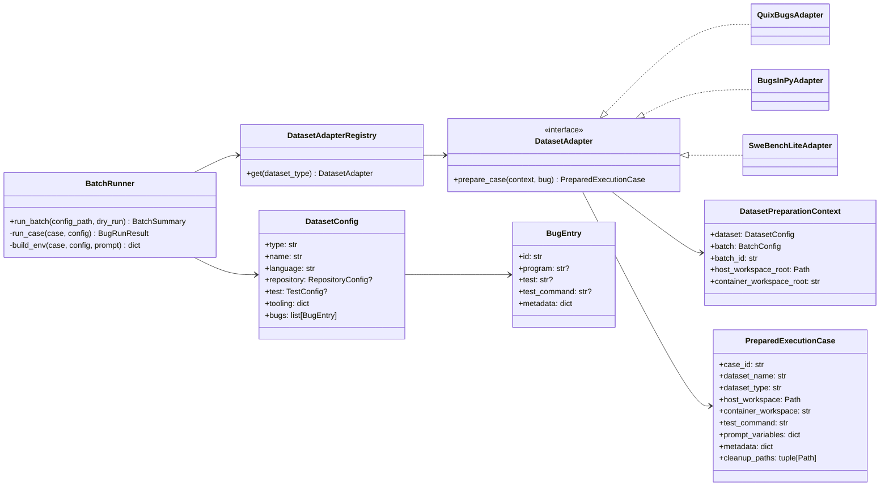

# Dataset Execution Architecture Plan v2 — Validated

## Objective

Refactor `autofix batch` so different APR datasets can be executed through one normalized case contract, without leaking dataset-specific logic into agents, providers, or architecture implementations.

The runtime should only receive:

- a prepared repository/workspace path visible inside the runner container;
- an optional branch only for remote/manual runs;
- the test command;
- the bootstrap prompt;
- model/architecture/observability settings.

Dataset-specific preparation belongs in dataset adapters: QuixBugs, BugsInPy, and later SWE-bench Lite.

---

## Key Design Decision

Use **one prepared workspace per bug case**.

Every adapter must produce a `PreparedExecutionCase` with both:

- `host_workspace`: path used by the host-side batch runner for preparation and error capture;
- `container_workspace`: equivalent mounted path passed to `RUN_REPOSITORY` inside Docker.

This avoids mixing remote repos, host-only paths, and container-only paths. It also prevents one bug run from mutating another bug run.

---

## Current Repo Constraints to Fix

The current implementation is not dataset-agnostic yet:

1. `DatasetConfig` requires one `repository`, one `branch`, and one `test_command_template` for the whole dataset.
2. `BugEntry` requires `program` and `test`, which does not fit all datasets.
3. `BatchRunner` prepares one repository before the loop and derives `RUN_*` directly from `DatasetConfig`.
4. `prepare_target_repository` only supports git URLs/slugs and always requires `branch`.
5. `autofix run` requires `RUN_BRANCH` even when the repository is already a local mounted workspace.
6. `docker-compose.yml` does not mount a benchmark workspace directory.
7. Prompt generation hardcodes `{bug_id}`, `{program}`, and `{test}`.

These must be fixed as part of this refactor.

---

## Target Flow

```text
autofix batch <batch.yml>
  -> load BatchConfig
  -> load DatasetConfig
  -> adapter = DatasetAdapterRegistry.get(dataset.type)
  -> expand selected bugs
  -> for each bug:
       case = adapter.prepare_case(context, bug)
       error_output = capture_error_output(case.host_workspace, case.test_command)
       prompt = PromptBuilder.build(template, case.prompt_variables, error_output)
       env = RuntimeEnvBuilder.build(case, config, prompt)
       docker compose run runner
       parse result
       cleanup according to policy
  -> write BatchSummary
```

No `if dataset.type == ...` logic should exist in `BatchRunner`.

---

## Minimal Domain Model

Do not introduce more abstractions than necessary.

### `PreparedExecutionCase`

```python
@dataclass(frozen=True, slots=True)
class PreparedExecutionCase:
    case_id: str
    dataset_name: str
    dataset_type: str
    host_workspace: Path
    container_workspace: str
    test_command: str
    prompt_variables: dict[str, str]
    metadata: dict[str, Any] = field(default_factory=dict)
    cleanup_paths: tuple[Path, ...] = ()
```

This replaces direct use of `DatasetConfig.repository`, `DatasetConfig.branch`, and `DatasetConfig.resolve_test_command()` inside `BatchRunner`.

### `DatasetPreparationContext`

```python
@dataclass(frozen=True, slots=True)
class DatasetPreparationContext:
    dataset: DatasetConfig
    batch: BatchConfig
    batch_id: str
    host_workspace_root: Path
    container_workspace_root: str
```

### `DatasetAdapter`

```python
class DatasetAdapter(Protocol):
    type: str

    def prepare_case(
        self,
        context: DatasetPreparationContext,
        bug: BugEntry,
    ) -> PreparedExecutionCase:
        ...
```

### `DatasetConfig`

```python
class DatasetConfig(BaseModel):
    model_config = ConfigDict(extra="forbid")

    type: str
    name: str
    language: str
    repository: RepositoryConfig | None = None
    test: TestConfig | None = None
    tooling: dict[str, Any] = Field(default_factory=dict)
    bugs: list[BugEntry]
```

### `BugEntry`

```python
class BugEntry(BaseModel):
    model_config = ConfigDict(extra="forbid")

    id: str
    program: str | None = None
    test: str | None = None
    test_command: str | None = None
    metadata: dict[str, Any] = Field(default_factory=dict)
```

Dataset-specific fields go under `metadata`, not as top-level fields.

---

## Class Diagram



---

## Implementation Steps

### 1. Mount benchmark workspaces

Update `docker-compose.yml`:

```yaml
volumes:
  - ./results:/results
  - ./benchmark-workspaces:/benchmark-workspaces
  - ${DOCKER_SOCKET_PATH:-/var/run/docker.sock}:/var/run/docker.sock:ro
```

Batch workspaces must be created under:

```text
<project_dir>/benchmark-workspaces/<batch_id>/<case_id>
```

The corresponding container path is:

```text
/benchmark-workspaces/<batch_id>/<case_id>
```

### 2. Make local mounted repositories valid runtime input

Update `repo_source.prepare_target_repository`:

- accept `branch: str | None`;
- if `repository` is an existing local directory, return it directly and ignore branch;
- if `repository` is remote, clone it; require branch unless default branch support is explicitly implemented.

Update `ContainerInstantiation` and `autofix run`:

- allow `RUN_BRANCH` to be empty/missing for local mounted workspaces;
- keep `RUN_BRANCH` required for remote git runs.

This is mandatory because adapters will pass `RUN_REPOSITORY=/benchmark-workspaces/...`.

### 3. Refactor batch config schema

Modify `batch/config.py`:

- add `DatasetConfig.type`;
- replace global `repository`, `branch`, and `test_command_template` with `RepositoryConfig` and `TestConfig`;
- make `BugEntry.program` and `BugEntry.test` optional;
- add `BugEntry.metadata`;
- keep `BatchConfig` mostly unchanged.

Do not add dataset-specific fields to `BatchConfig`.

### 4. Add dataset adapter package

Create:

```text
src/llm_autofix_agents/datasets/
  __init__.py
  base.py
  registry.py
  quixbugs.py
  bugsinpy.py
```

`base.py` contains `PreparedExecutionCase`, `DatasetPreparationContext`, and `DatasetAdapter`.

`registry.py` maps:

```python
{
    "quixbugs": QuixBugsAdapter(),
    "bugsinpy": BugsInPyAdapter(),
}
```

Do not implement SWE-bench Lite yet. Leave it as a future adapter.

### 5. Implement `QuixBugsAdapter`

Responsibilities:

- require `dataset.repository.url` and `dataset.repository.branch`;
- create `host_workspace` for the case;
- shallow clone QuixBugs into that workspace;
- resolve `test_command` from `bug.test_command` or `dataset.test.command_template`;
- return `PreparedExecutionCase` with:
  - `host_workspace=<host path>`;
  - `container_workspace=/benchmark-workspaces/<batch_id>/<case_id>`;
  - `test_command=<resolved command>`;
  - prompt variables: `bug_id`, `program`, `test`, `test_command`, `dataset_name`.

This preserves current QuixBugs behavior but removes direct QuixBugs assumptions from `BatchRunner`.

### 6. Refactor `BatchRunner`

Remove this pattern:

```python
repo = prepare_target_repository(dataset.repository, dataset.branch)
```

inside `run_batch`.

Instead, inside the bug loop:

```python
case = adapter.prepare_case(context, bug)
```

Then:

- capture errors with `capture_error_output(case.host_workspace, case.test_command)`;
- build the prompt from `case.prompt_variables`;
- build env with:
  - `RUN_REPOSITORY=case.container_workspace`;
  - `RUN_BRANCH=""`;
  - `RUN_TEST_COMMAND=case.test_command`;
- run Docker;
- cleanup `case.cleanup_paths` after the run if configured.

Preparation failures should produce a `BugRunResult(status="infra_failure")` for that bug and continue the batch. They should not kill the whole batch unless configuration loading or Docker build fails.

### 7. Refactor prompt generation

Replace hardcoded prompt variables with generic variables:

```python
variables = {
    **case.prompt_variables,
    "error_output": error_output or "(error output not available)",
}
return template.format(**variables)
```

Adapters define which variables exist.

### 8. Implement `BugsInPyAdapter` smoke support

Responsibilities:

- read from `bug.metadata`:
  - `project`;
  - `bug_id`;
  - `version`, default `0`;
- create one host workspace per case;
- execute configurable checkout command, e.g.:

```yaml
checkout_command_template: >
  bugsinpy-checkout -p {project} -i {bug_id} -v {version} -w {host_workspace}
```

- optionally execute `compile_command` in the workspace if configured;
- set `test_command` from `bug.test_command` or `dataset.tooling.test_command`, default `bugsinpy-test`;
- return a normal `PreparedExecutionCase`.

For the first implementation, support one smoke case only. Do not import or run all BugsInPy bugs yet.

### 9. Add example configs

Create:

```text
configs/datasets/quixbugs.yml
configs/datasets/bugsinpy.yml
configs/batches/quixbugs-smoke.yml
configs/batches/bugsinpy-smoke.yml
```

Example QuixBugs:

```yaml
type: quixbugs
name: quixbugs-python
language: python

repository:
  url: https://github.com/jkoppel/QuixBugs.git
  branch: master

test:
  command_template: uv run --with pytest pytest python_testcases/test_{bug_id}.py

bugs:
  - id: gcd
    program: gcd
    test: python_testcases/test_gcd.py
```

Example BugsInPy:

```yaml
type: bugsinpy
name: bugsinpy
language: python

tooling:
  checkout_command_template: >
    bugsinpy-checkout -p {project} -i {bug_id} -v {version} -w {host_workspace}
  compile_command: bugsinpy-compile
  test_command: bugsinpy-test

bugs:
  - id: youtube-dl-2
    program: youtube-dl
    metadata:
      project: youtube-dl
      bug_id: "2"
      version: "0"
```

### 10. Add tests

Minimum tests:

- new dataset YAML schema loads correctly;
- registry returns the correct adapter;
- QuixBugs adapter builds the expected workspace, test command, and prompt variables;
- BugsInPy adapter builds checkout/compile/test commands with mocked subprocess;
- `BatchRunner` uses `PreparedExecutionCase` fields, not `dataset.repository` or `dataset.resolve_test_command()`;
- local mounted workspace works with empty `RUN_BRANCH`;
- adapter preparation failure becomes per-case `infra_failure`.

Do not unit-test actual Docker execution.

### 11. Document architecture

Add:

```text
docs/dataset_execution_architecture.md
```

It must explain:

- agents are dataset-agnostic;
- adapters prepare executable cases;
- every case has host and container workspace paths;
- QuixBugs is clone-based;
- BugsInPy is checkout-tool-based;
- SWE-bench Lite will be added as another adapter, not as a new runtime path.

---

## SWE-bench Lite Later

Do not implement now.

The future adapter should:

- read `instance_id`, `repo`, `base_commit`, `problem_statement`, `FAIL_TO_PASS`, and `PASS_TO_PASS` from metadata;
- prepare a host workspace at `base_commit`;
- expose `problem_statement` as a prompt variable;
- build a validation command for selected tests;
- return `PreparedExecutionCase`.

No agent/runtime architecture change should be required.

---

## Non-goals

Do not implement:

- a generic workflow engine;
- dataset-specific logic inside agents;
- dataset-specific `if` branches inside `BatchRunner`;
- full BugsInPy import before one smoke case works;
- SWE-bench Lite execution harness in this milestone;
- caching/reusing cloned workspaces unless repeated clone time becomes a real bottleneck.

---

## Acceptance Criteria

The refactor is complete when:

1. Existing QuixBugs smoke execution works through `QuixBugsAdapter`.
2. A BugsInPy smoke YAML prepares one workspace and executes through the same batch runner.
3. `BatchRunner` depends on `PreparedExecutionCase`, not dataset-specific fields.
4. `RUN_REPOSITORY` can point to a mounted local workspace.
5. `RUN_BRANCH` is optional for local workspaces.
6. Prompt generation is based on adapter-provided variables.
7. A preparation error in one case is reported as `infra_failure` and does not stop the whole batch.
8. Adding SWE-bench Lite later requires a new adapter and YAML, not changes to agents or runtime architecture.
